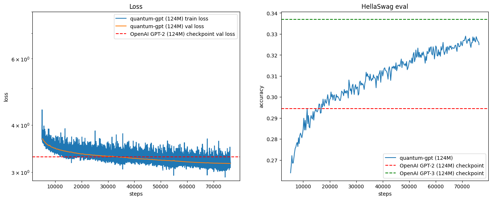

## Quantum GPT

This is a LLM model based on GPT2 with some improvements from OpenAI GPT3 paper.

The training data used is Fineweb - https://huggingface.co/datasets/HuggingFaceFW/fineweb 10b tokens

The training has been done for 4 epochs across the whole 10b tokens

Below are the results:

To train the model, run - `torchrun --standalone --nproc-per-node=8 train.py --resume False --last_checkpoint_step 0`

To get output from the model(inferencing), run `python inference.py`
